# :rocket: Demo: Flyway, Spawn and Synthesized TDK to test database migrations

This repository is a demo example that shows how to use [Flyway](https://flywaydb.org/), [Spawn](https://spawn.cc/), and [TDK](https://docs.synthesized.io/tdk/latest/) to test database migrations using GitHub Actions.

This demo is based on a tutorial from the Flyway documentation, [Testing Flyway migrations in a CI pipeline](https://flywaydb.org/documentation/tutorials/migrationtesting). We use Synthesized TDK here to mask production data, ensuring that it does not leave the production environment.

The main difference between this demo and the original is the method used to take a production snapshot. In the original demo, the data was copied as is:

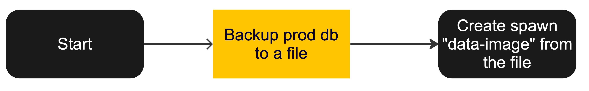

In our version, we save dumps from a masked database that was created with TDK:

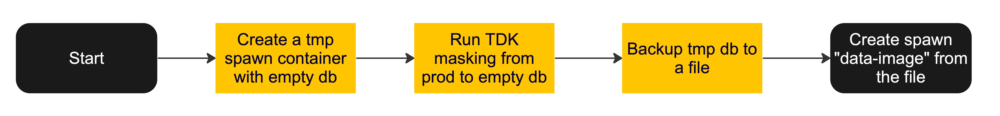

TDK configuration can be found in the `./tdk` directory. Here is an example of the configuration for the `customer` table:

```yaml
default_config:
  mode: MASKING

cycle_resolution_strategy: DELETE_NOT_REQUIRED
table_truncation_mode: TRUNCATE
schema_creation_mode: DO_NOT_CREATE
safety_mode: "RELAXED"

tables:
  - table_name_with_schema: "public.customer"
    transformations:
      - columns: [ "first_name", "last_name", "email" ]
        params:
          type: "person_generator"
          column_templates: [ "${first_name}", "${last_name}", "${email}" ]
```

In this example, we mask all columns by default and additionally generate realistic values for customers.

To view the full configuration, check the `./tdk/config.yaml` file.

## Table of contents

- [Preparation](#Preparation)
- [Running](#Running)
- [Screenshots](#Screenshots)

## Preparation 

Before running the demo, we need to prepare the RDS database.

Before starting, change the directory:

```bash
cd rds
```

1. Create a new RDS database instance in AWS. The database should be publicly accessible and have a username and password set.

```bash
PGPASSWORD=<RDS_PASSWORD> ./create-pagila-db.sh
```
Check the status of the database instance and wait until it's active.

2. Insert the data into the database.

Go to the AWS RDS console and copy the endpoint of the database. Then run the following command:

```bash
PAGILA_HOST=<RDS_HOST> PAGILA_USERNAME=postgres PAGILA_PASSWORD=<RDS_PASSWORD> ./insert-data.sh 
```

3. Create GitHub secrets.

You need to set the following variables:
- `PAGILA_HOST`
- `PAGILA_ADMIN_USERNAME`
- `PAGILA_ADMIN_PASSWORD`

## Running

1. Take production database snapshot.

- Go to GitHub Actions
- Click `Take backup of production database daily`
- Click `Run workflow`
- Check logs

This should trigger a job which will create a Spawn snapshot containing masked production data.

2. Run migrations test

- Go to GitHub Actions
- Click `Database migration test`
- Click `Run workflow`
- Check logs

In the logs, you should see how we spawn a data container using a production snapshot from step 1 and run the last migration (number 13).

## Screenshots

1. Comparison of production and snapshot data.

Staff table Production vs Snapshot: 
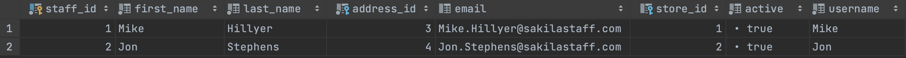
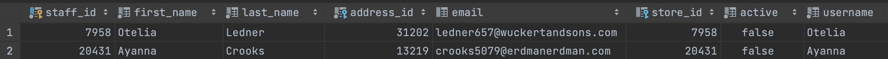

Customer table Production vs Snapshot: 
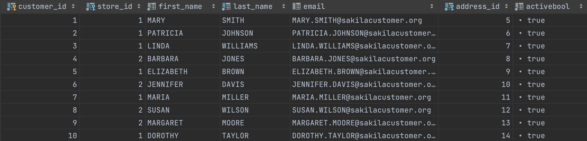
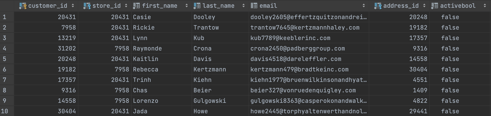

Address table Production vs Snapshot: 
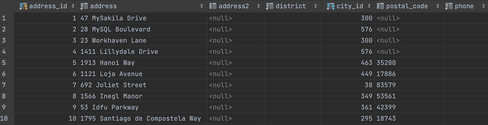
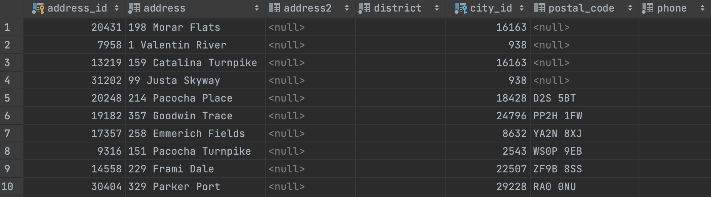

Payment table Production vs Snapshot: 
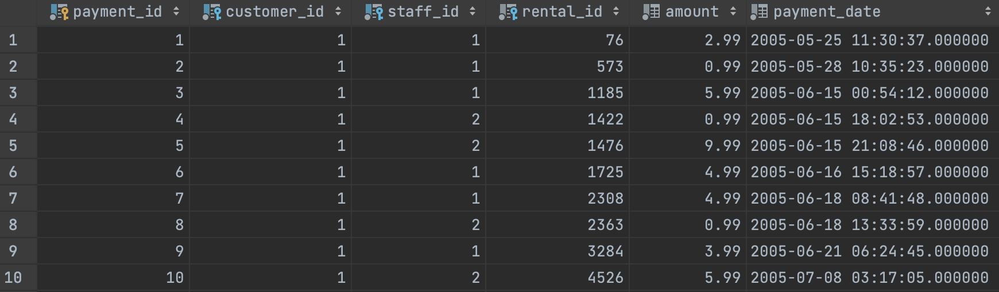
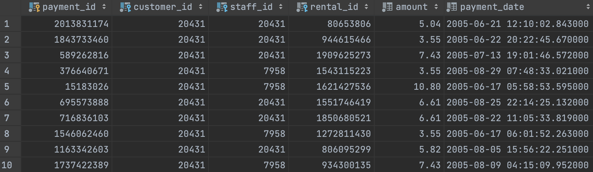

Please note that sensitive values, such as names, emails, and addresses, are masked with realistic values.
Primary and foreign keys are masked preserving referential integrity across tables.
Payment amounts, dates, and booleans are masked preserving the distribution of the original data.

3. Sample log of successful migration

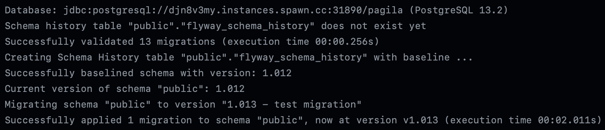

Migration ran successfully. Given that the schema of the snapshot database is exactly the same as the production one,
we can be sure that the migration will run successfully in production as well.
